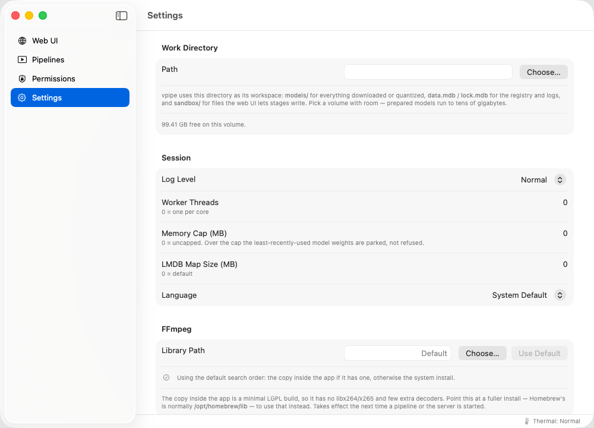
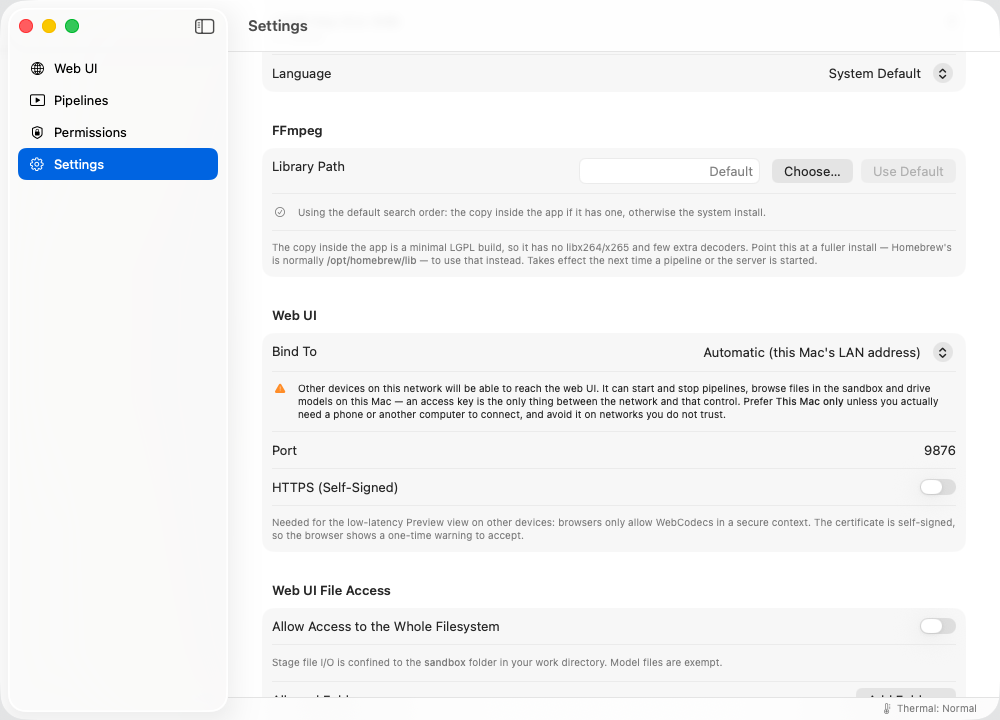
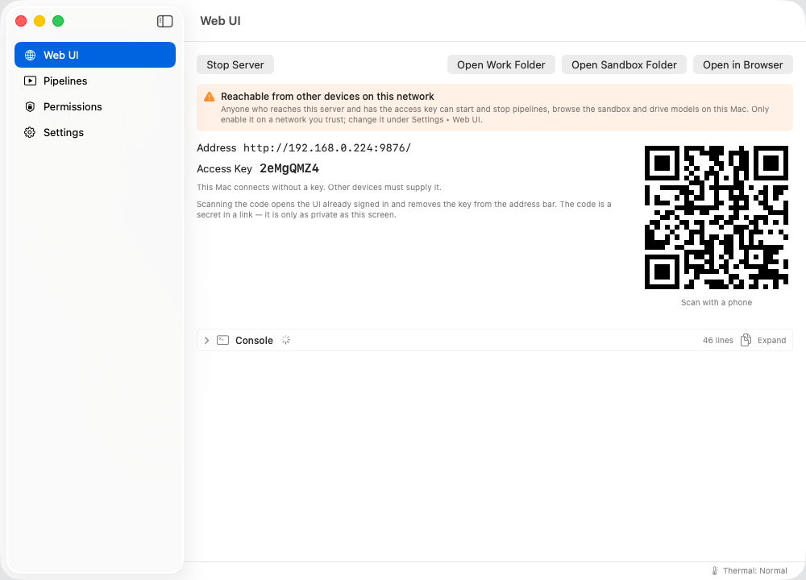
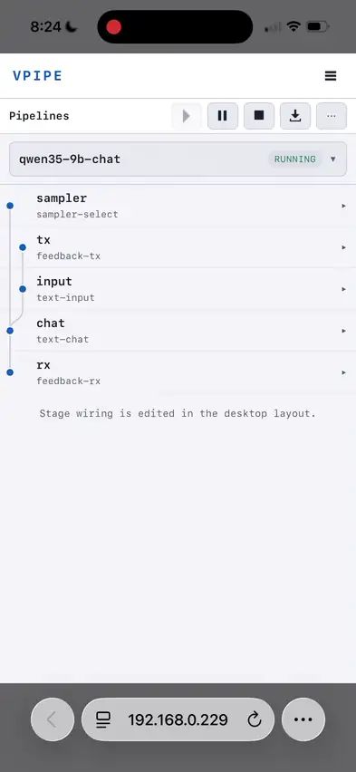

<a id="top"></a>
# VPIPE

**Lightweight local multimodal AI pipelines and custom Metal inference for Apple Silicon Macs.**

- **Multimodal graph:** video, audio, images, text, and tool actions in one pipeline.
- **Native Metal inference:** custom kernels and no third-party tensor runtime, for optimal speed.
- **Base-model Mac friendly:** weight streaming and 4-bit model preparation for image/video generation on 16 GB machines.
- **Out-of-the-box workflows:** image editing, MiniMax H3 video, Qwen chat, realtime VQA, ASR/TTS, and local tool calling.
- **Reproducible Composer:** save layouts, prompts, params, and model config with each pipeline spec.
- **Easy to use:** macOS app, web UI control, and remote access from a phone browser.

**[Download the macOS app](https://github.com/tgo-app-dev/vpipe/releases/latest)**
· **[Run the first example](#first-example)**
· **[Try image editing](docs/KLEIN-KV.md)**
· **[Try MiniMax H3 video](docs/MINIMAX-H3.md)**

For the easiest install, choose the largest `.dmg` in the latest release.

<p align="center">
  
</p>

&emsp;&emsp;*Prompt-driven image editing in Composer: live pipeline graph,
preview panels, profiler, and reproducible model configuration.*

## Why VPIPE

- Runs **MiniMax H3** FL2VA and REF2VA on an Apple Silicon Mac — a 33B model
  generating video **and its soundtrack together**, on as little as 16 GB.
  Now with **Turbo LoRA** support!
  See **[docs/MINIMAX-H3.md](docs/MINIMAX-H3.md)**

  * 5s @ 0.5 MP 24p, 6 steps takes **13 minutes** on a fanless
    15-inch **base-model** M5 MacBook Air, 16 GB [^1]

- Runs **LTX-2.5** on an Apple Silicon Mac — a 22B model generating video
  and its soundtrack together, again on as little as 16 GB, through the
  [vpipe-ltx-2.5 plugin](https://github.com/tgo-app-dev/vpipe-ltx-2.5).

- **Image and video generation on base-model Macs** with weight streaming —
  walk through a reference image edit in
  **[docs/KLEIN-KV.md](docs/KLEIN-KV.md)**

- **Realtime multimodal pipelines** for VQA, ASR, chat, TTS, image editing,
  video generation, and tool use.
  Now with **Qwen 3.8 27B** support!

- **Full-modality runtime under 30 MB** [^2], with a mobile-friendly web UI

- Extra acceleration from the **NAX** matmul2d and convolution2d units on
  M5-generation hardware

[^1]: Fanless, and this run was helped by an ice pack under the
      chassis — a stock Air will throttle sooner and take longer.

[^2]: Build from source artifact size, not counting dynamically linked
      dependencies like FFmpeg, libcurl.

## Local AI use cases

| Use case | What VPIPE provides |
| --- | --- |
| Local image editing | Prompt tuning, image comparison, mask/reference pipelines, and reproducible Composer layouts. |
| Text-to-video and image-to-video | MiniMax H3 pipelines with video and soundtrack generation on Apple Silicon. |
| Multimodal chat | Stateful local chat that can read images without re-prefilling the whole thread. |
| Realtime VQA and video monitoring | Video capture, detection, tracking, audio tagging, overlays, preview, and profiling in one graph. |
| Local AI agents | Sandboxed file, shell, Python, and web tools exposed through local MCP-style stages. |
| Developer integration | A compact embeddable C++ runtime plus ready-to-run pipeline specs and reference workflows. |

## FAQ

**What is VPIPE?** VPIPE is a local multimodal AI runtime for Apple Silicon
Macs. It turns models, media streams, user input, and tool actions into
inspectable C++ pipeline graphs.

**Does VPIPE use MPS, MLX, or Python for inference?** No. VPIPE's generative
model forward pass runs through Metal kernels directly via its own
**metal-compute** backend. Python support exists only outside that forward path.

**Can VPIPE run local image and video generation on a 16 GB Mac?** Yes, for
supported workflows. VPIPE uses weight streaming and 4-bit model preparation
to make image editing and video generation practical on base-model Apple
Silicon machines.

**Is VPIPE a ComfyUI alternative for Mac?** For some local image and video
workflows, yes. VPIPE focuses on ready-to-run, reproducible pipelines with
saved UI layouts and a native Apple Silicon compute backend, rather than a
large general-purpose node ecosystem.

---

[](LICENSE)


[**Install**](#install) · [**Quickstart**](#quickstart) ·
[**First example**](#first-example) · [**Overview**](#overview) ·
[**Examples**](EXAMPLES.md)

For developers: [**Requirements**](#requirements) ·
[**Build from source**](#build-from-source) · [**Run**](#run) ·
[**Tests**](#tests) · [**Structure**](#structure) ·
[**Acknowledgements**](#acknowledgements) · [**License**](#license)

---

## Install
[back to top](#top)

### The macOS app

**[Download the latest release ▸](https://github.com/tgo-app-dev/vpipe/releases/latest)**
Open the `.dmg`, drag **Vpipe Manager** to Applications, and launch it.
Requires an **Apple Silicon Mac** running **macOS 26 or later**.

Two builds are published. They are the same app; they differ only in
whether FFmpeg travels with it:

| Download | Size | Pick this if |
| --- | --- | --- |
| `VpipeManager-<version>-with-ffmpeg.dmg` | ~28 MB | You want it to work immediately. Nothing else to install. |
| `VpipeManager-<version>-slim.dmg` | ~16 MB | You already have FFmpeg installed — Homebrew's, say — and would rather use it. |

The bundled copy is a minimal **LGPL** build: it covers the common
formats and keeps hardware H.264/HEVC/ProRes through VideoToolbox, but
it has no libx264/x265. If you take the slim build, point the app at
your own FFmpeg — [Quickstart](#quickstart) covers where.

The app is signed and notarized, so it opens without a Gatekeeper
warning, and it updates itself: **Vpipe Manager ▸ Check for Updates…**

> **What you get.** The app is a launcher around the same two binaries
> the command line uses — it does not reimplement anything. Its real
> advantage is **permissions**: Camera, Microphone and Local Network
> access are granted to the app under its own name, instead of to
> whichever terminal you happened to run from.

### Build it yourself

Everything also builds from source. The pipeline core and the non-Apple
stages are portable C++20 and build on Linux and Intel macOS; the on-device
model stack needs an Apple Silicon Mac.

```sh
git clone --recursive https://github.com/tgo-app-dev/vpipe.git
cd vpipe && cmake -S . -B build && cmake --build build -j
```

That is the whole story when the dependencies are already in place. For
prerequisites, build options, the Metal toolchain and the rest, see
**[Requirements](#requirements)** and
**[Build from source](#build-from-source)** below.

---

## Quickstart
[back to top](#top)

Getting from a fresh install to a working browser UI. Everything here
is in the app; the command-line equivalents are under [Run](#run).

**1. Choose a work directory.** *Settings ▸ Work Directory ▸ Path ▸
Choose…* — it defaults to `~/vpipe`.

This is where everything lives: `models/` for anything downloaded or
quantized, `sandbox/` for files pipelines are allowed to write, and the
LMDB registry and logs. **Pick a volume with room.** Prepared models
run to tens of gigabytes — MiniMax H3 downloads ~115 GB and peaks near
155 GB while it quantizes — and the app shows the free space on the
volume you select. Moving it later means moving all of that.

**2. Point at FFmpeg — only if you took the slim build.** *Settings ▸
FFmpeg ▸ Library Path ▸ Choose…*

Homebrew's is normally **`/opt/homebrew/lib`**. The row above the
button says whether a usable FFmpeg was found, so you are not guessing.
**Use Default** returns to the bundled copy. Either way the change
takes effect the next time you start a pipeline or the server — it is
not picked up by something already running.

<p align="center">
  
</p>

**3. Decide who can reach the web UI.** *Settings ▸ Web UI ▸ Bind To*

- **This Mac only (127.0.0.1)** — nothing else on the network can
  connect, and no access key is needed. Start here.
- **Automatic (this Mac's LAN address)**, or a specific interface — so
  a phone or another computer can connect.

Anything other than *This Mac only* makes the web UI reachable from your
network, and anyone who reaches it can start and stop pipelines, browse
the sandbox and drive models on this Mac. An 8-character access key is
the only thing in front of that, so use a LAN binding only when you actually
need another device, and not on networks you do not trust. The app
warns you in place when you select one.

**Port** defaults to `9876`; change it if something else is using it.
**HTTPS (Self-Signed)** is only needed for the low-latency Preview view
on another device — browsers restrict WebCodecs to secure contexts —
and costs a one-time certificate warning.

<p align="center">
  
</p>

**4. Start it.** Open the **Web UI** pane and press **Start Server**,
then **Open in Browser**.

If you chose a LAN address in step 3, the pane also shows a **QR
code**: point a phone camera at it and the UI opens already
authenticated, with no key to retype. If you kept *This Mac only*,
there is no QR code — a phone could not reach `127.0.0.1` anyway. The
access key is still shown, but this Mac connects without it.
**Open Work Folder** and **Open Sandbox Folder** reveal those
directories in Finder.

<p align="center">
  
</p>

> **What the QR code contains.** Only a URL:
> `http://<this Mac's LAN address>:<port>/<token>`. The token is 14
> random characters, generated fresh at every start and never written
> to disk. Nothing about you, your files, your models or your machine
> is encoded in it — the single identifying detail is the LAN address,
> and that is a private one like `192.168.x.x`, which means nothing
> outside your own network.
>
> Treat it as a password anyway, because the token is not merely
> information. Scanning it redirects to `/?key=<access key>` and hands
> the access key over, so anyone who can both see the code *and* reach
> that address gets exactly the control you have: starting and stopping
> pipelines, browsing the sandbox, driving models on this Mac. A photo,
> a screenshot or a screen share is enough for someone on the same
> network. Restarting the server invalidates it.

The status row along the bottom shows the machine's **thermal state**.
Sustained image or video generation heat-soaks a Mac, a fanless MacBook
Air especially. When it reads *Throttling*, steps are taking longer
because of the hardware, not because something has stalled.

**Next:** the first example, below.

---

<a id="first-example"></a>
## First example — chat with a 9B model
[back to top](#top)

The shortest path from a working install to a model answering you: two
pipeline files, **~7.7 GB** on disk, and no conversion step to sit through —
this checkpoint arrives already quantized.

1. **Get both pipelines** —
   [`prepare-qwen35-9b-optiq-4bit.vpipeline`](docs/pipelines/prepare-qwen35-9b-optiq-4bit.vpipeline)
   and [`qwen35-9b-chat.vpipeline`](docs/pipelines/qwen35-9b-chat.vpipeline)
   (**Raw ▸ Save as**, or straight from `docs/pipelines/` in a clone).
2. **In the web UI from the Quickstart**, open the Pipeline Manager, **Load**
   the `prepare-` one and press **Start**. It downloads the model into your
   work directory and registers it there. Once, and never again.
3. **Load the chat pipeline, Start it, open the User I/O panel** — and type
   at the `you>` prompt.

```
you> In one sentence, what is the Pacific Ocean?
The Pacific Ocean is the largest and deepest ocean on Earth, covering more
than 30% of the planet's surface area and separating the continents of Asia
and Australia to the east from North and South America to the west.
```

Five stages: a text input, the chat stage, a **sampler** stage carrying the
values this checkpoint recommends for itself, and a feedback pair that makes
it turn-by-turn. You can attach a picture to a turn — this model reads
images too.

<p align="center">
  
</p>

&emsp;&emsp;*The same pipeline from a phone — scan the QR code the server
prints and the browser opens already authenticated. Here a photographed
receipt is transcribed, then questioned: the follow-up answers from the same
context, and the Mac decodes at ~19.7 tok/s throughout.*

From a source build the same two files run on the command line, which is
where a chat prompt is most at home:

```sh
cd ~/vpipe                    # your work directory, with both files in it
/path/to/vpipe --launch prepare-qwen35-9b-optiq-4bit.vpipeline
/path/to/vpipe --launch qwen35-9b-chat.vpipeline
```

`/path/to/vpipe` is the binary from your build — `build/apps/vpipe/vpipe`
inside the source tree.

**▸ [docs/QWEN35-CHAT.md](docs/QWEN35-CHAT.md)** — the walkthrough: what each
stage is for, why sampling is a stage rather than a config key, and the knobs
worth knowing.

**Then:** **[EXAMPLES.md](EXAMPLES.md)** builds the same chat by hand in the
web UI, and adds speech transcription. For image editing from a reference
photo, **[docs/KLEIN-KV.md](docs/KLEIN-KV.md)**; for text-to-video *with
sound*, **[docs/MINIMAX-H3.md](docs/MINIMAX-H3.md)**. Each ships the
pipelines it describes.

---

## Overview
[back to top](#top)

VPIPE has three main surfaces:

- **Pipeline core** — coroutine-based `Job` stages connected by buffered ports,
  driven by a runtime that launches and drains them concurrently. Stages are
  composed into a pipeline from a JSON spec; each stage registers under a
  type name (e.g. `rtsp-capture`, `video-to-rgb`, `yolo-detection`,
  `onvif-discovery`, `rest-client`). This layer is portable C++20.

- **On-device generative-model stack** *(Apple Silicon)* — a from-scratch
  LLM/VLM/ASR/diffusion/video inference stack running on **metal-compute**,
  with custom kernels, model loading, quantization support, weight streaming,
  and resource planning for memory-constrained Macs. It powers stages such as
  `text-chat`, `visual-qa`, `realtime-vqa`, `audio-transcribe`,
  `generate-image`, `diffusion-conditioner`, `vae-encode`, `vae-decode`, and
  `generate-video`.

- **Web UI and Composer** — a self-contained browser UI for launching,
  inspecting, profiling, and editing pipelines. The Composer can arrange
  pipeline editors, previews, image comparison views, text I/O, profiler views,
  files, logs, and stage-provided panels, then save that layout with the
  pipeline spec so a workflow can be reopened and reproduced.

Models are loaded from local directories (sharded safetensors / GGUF) and are
not bundled with the source.

> **Platform note.** The pipeline core and the non-Apple stages build on Linux
> and Intel macOS, but the generative-model stack and the CoreML/Metal stages
> require an **Apple Silicon Mac**. On arm64 macOS these features are detected
> and enabled automatically.

---

<a id="developers"></a>
## For developers and power users
[back to top](#top)

Everything above describes the app. The rest of this file is the source
tree: what it needs to build, how to drive the same session from the
command line, from Python or from a test binary, and where things live.

---

## Requirements
[back to top](#top)

- **CMake ≥ 3.25** and a **C++20** compiler (Apple Clang or a recent Clang/GCC).
- **Git** (the build pulls a few dependencies as submodules).
- **FFmpeg development headers** — `libavformat`, `libavcodec`, `libavutil`,
  `libswresample`. VPIPE compiles against the headers and `dlopen`s the
  libraries at runtime, so FFmpeg must also be installed at runtime to decode
  media.
  - macOS: `brew install ffmpeg`
  - Debian/Ubuntu: `apt install libavformat-dev libavcodec-dev libavutil-dev libswresample-dev`
- **libcurl** — used by the `rest-client` stage. Provided by the SDK on macOS;
  on Linux install e.g. `apt install libcurl4-openssl-dev`.
- **Python 3 + development headers** — only for the optional Python extension
  (built by default). Disable with `-DVPIPE_BUILD_PYTHON=OFF` if you don't need
  it.
- **Apple Silicon Mac** — for the on-device inference stack and CoreML/Metal
  stages.
- **Metal shader toolchain** *(Apple Silicon builds only; recommended, not
  required)* — by default the build compiles `.metal` kernel sources into
  embedded metallibs using `xcrun -sdk macosx metal` and
  `xcrun -sdk macosx metallib`. These compilers are part of Xcode's **Metal
  Toolchain**; the standalone *Command Line Tools* do **not** include them, even
  though the rest of the build never opens Xcode.

  **No toolchain? The build falls back automatically.** If `metal`/`metallib`
  aren't found at configure time, the build switches to **runtime-compile
  mode**: it embeds the Metal shader *source* and compiles each kernel on first
  use via the OS's built-in runtime compiler (`newLibraryWithSource:`), which
  needs no toolchain on the build **or** run machine. The Metal Toolchain is
  therefore optional; the tradeoff is a one-time per-kernel compile on first use
  instead of at build time. Force either mode with
  `-DVPIPE_METAL_RUNTIME_COMPILE=ON|OFF`.

  To get the faster build-time (AOT) path, install the toolchain. Two
  independent things can leave `metal`/`metallib` unavailable — both surface the
  same way, as `error: cannot execute tool 'metal'` or `xcrun: error: unable
  to find utility "metal"`:

  **1. The Metal Toolchain isn't installed.** On **Xcode 26 and later**
  (macOS 26) the Metal Toolchain is no longer bundled with Xcode by default —
  it's an optional component you download once. Install it from the command
  line (or via Xcode ▸ Settings ▸ Components ▸ Metal Toolchain ▸ Get):

  ```sh
  xcodebuild -downloadComponent metalToolchain     # download + install
  ```

  On air-gapped or CI machines, export once and import where needed:

  ```sh
  xcodebuild -downloadComponent metalToolchain -exportPath ~/Downloads
  xcodebuild -importComponent metalToolchain ~/Downloads/metalToolchain.dmg
  ```

  **2. `xcrun` points at the Command Line Tools, not Xcode.** If you installed
  the CLT and *then* Xcode, `xcrun` often still resolves to the standalone CLT,
  which lacks `metal`/`metallib`. Point the toolchain at Xcode:

  ```sh
  # Direct xcrun at the Xcode app (run once; needs admin)
  sudo xcode-select --switch /Applications/Xcode.app/Contents/Developer
  sudo xcodebuild -license accept    # accept the license if you haven't
  ```

  Verify the active developer dir and that both compilers resolve:

  ```sh
  xcode-select -p                 # -> /Applications/Xcode.app/Contents/Developer
  xcrun -sdk macosx -f metal      # -> a path inside Xcode.app (not /Library/Developer/CommandLineTools)
  xcrun -sdk macosx -f metallib   # -> likewise
  xcrun -sdk macosx metal --version
  ```

  To switch back to the Command Line Tools later:
  `sudo xcode-select --switch /Library/Developer/CommandLineTools`.

---

## Build from source
[back to top](#top)

**1. Fetch dependencies.** LMDB and pugixml are always required; nanobind is
needed for the Python bindings, and metal-cpp for the Apple Silicon features:

```sh
git submodule update --init extern/lmdb extern/pugixml extern/nanobind extern/metal-cpp
```

**2. Configure** (out-of-source build directory):

```sh
cmake -S . -B build
```

This defaults to an optimized **Release** build, so the binaries you get are
performant out of the box. Override the build type explicitly if you want a
debug build:

```sh
cmake -S . -B build -DCMAKE_BUILD_TYPE=Debug
```

**3. Build:**

```sh
cmake --build build -j
```

`cmake --build` is generator-agnostic; use it rather than calling `make`
directly so the build works regardless of which generator CMake selected.

Useful options (pass at configure time with `-D`):

| Option | Default | Effect |
| --- | --- | --- |
| `VPIPE_BUILD_PYTHON` | `ON` | Build the `vpipe` Python extension (needs Python dev headers). |
| `VPIPE_BUILD_APPLE_SILICON` | auto (on for arm64 macOS) | Build the CoreML/metal-compute wrappers and the inference stages. |
| `CMAKE_BUILD_TYPE` | `Release` (when unset) | Set `Debug` for an unoptimized debug build. |

**Install** (optional):

```sh
cmake --install build --prefix /path/to/install
```

---

## Run
[back to top](#top)

### Web UI

`vpipe-web-ui` serves a browser-based Pipeline Manager bound to one VPIPE
session. The web assets are embedded in the binary, so no extra files are
needed:

```sh
./build/apps/web-ui/vpipe-web-ui                    # listens on the LAN address, port 9876
./build/apps/web-ui/vpipe-web-ui --bind 127.0.0.1   # this machine only
```

Then open the printed URL (e.g. `http://localhost:9876`). By default it binds
to the machine's LAN address so other devices can connect; remote connections
must supply the 8-character access key printed at startup, while localhost
connects without one. Options: `--bind ADDR`, `--port N` (`0` = any free port),
`--config CFG` (inline JSON, a file path, or empty for defaults), `--help`.

#### Connecting a phone (`--show-qr`)

The UI has a phone layout, and typing an 8-character key into a phone is
exactly the friction that stops anyone from using it. `--show-qr` prints a
QR code to the console next to the usual startup lines:

```sh
./build/apps/web-ui/vpipe-web-ui --show-qr
```

Point a phone camera at it and the UI opens **already authenticated** — no key
to read off the screen and retype. The phone layout is selected automatically
from the device; `?ui=desktop` (or the drawer's *Desktop layout*) overrides it,
and `?ui=phone` is how that layout is developed on a desktop.

How it works, and what it costs:

- **Two different secrets.** The 8-character access key is short because a
  human retypes it. The QR link carries its own, longer secret (14 characters
  of an uppercase alphanumeric alphabet, ~70 bits), because nothing has to read
  it — it only has to be unguessable.
- **One scan, then the key is gone.** `GET /<link-secret>` redirects to
  `/?key=<access key>`; the page adopts the key into `sessionStorage` and
  immediately strips it from the URL, so it never lands in the address bar,
  the history, or a bookmark. The key is tab-scoped and disappears when the
  tab closes.
- **The link is never printed.** Only the symbol is rendered — writing the URL
  beside it would put the secret into the scrollback, a screen share, or a
  terminal log, which is what the QR code exists to avoid. It is a secret in a
  URL: treat it as **only as private as the console displaying it**, and
  restart the server to invalidate it.
- **Both secrets are per-run**, generated at startup, and neither is written to
  disk.

Requests from other computers carry the key as an `X-Auth-Key` header (or a
`?key=` parameter where the browser cannot set headers, such as a WebSocket
handshake or an `` source). Only `/api/*` is gated, and only for
non-loopback peers — static assets stay open so a remote browser can load the
page in order to ask for the key in the first place.

> **Note.** Add `--tls` if you want the low-latency Preview view on a phone or
> any other LAN client: the browser's WebCodecs API is secure-context only, so
> it needs HTTPS off localhost. The certificate is self-signed and cached under
> `~/.vpipe/webui-tls`, so expect a one-time browser warning — and a QR scan
> lands on that warning rather than the UI until it is accepted.

### CLI

`vpipe` launches pipelines straight from the terminal — a thin command-line
front end over the same session and stages the web UI drives. It dynamically
links `libvpipe`.

```sh
# A full pipeline from a saved spec file, or from inline JSON:
./build/apps/vpipe/vpipe --launch my-pipeline.vpipeline
./build/apps/vpipe/vpipe --launch '{"id":"tick","stages":[{"id":"c","type":"chrono","config":{"count":5}}]}'

# A single stage wrapped in a one-shot pipeline (handy for utility stages):
./build/apps/vpipe/vpipe --launch-stage onvif-discovery
./build/apps/vpipe/vpipe --launch-stage model-fetch \
  --stage-cfg model_path=mlx-community/Qwen3.5-4B-MLX-4bit
```

`--stage-cfg` overrides stage config: `key=value` after `--launch-stage`, or
`stage-id::key=value` to target a stage inside a `--launch` spec. Repeat
`--launch` / `--launch-stage` to run several pipelines **concurrently**;
`Ctrl-C` stops them cleanly. `vpipe --help` lists every option, and
**[EXAMPLES.md](EXAMPLES.md)** shows fetching a model from the terminal.

### Python

The extension lands in `build/python/`. Importing the package creates a default
session:

```sh
PYTHONPATH=build/python python3 -c "import vpipe; print(vpipe.vpipe_version())"
```

Startup configuration is resolved from `VPIPE_CONFIG` / `VPIPE_CONFIG_FILE`, an
`./init.vpipe` file, or built-in defaults. Call `vpipe.create_session(config=...)`
to make your own session.

---

## Tests
[back to top](#top)

The build produces a unit-test executable:

```sh
./build/vpipe_test                        # run everything
./build/vpipe_test --list_tests
./build/vpipe_test --filter '<pattern>'   # supports * and ? wildcards
./build/vpipe_test --color off            # for captured/non-interactive output
```

Some tests exercise real models and are gated on environment variables that
point at local model directories; when a variable is unset, the corresponding
test skips.

---

## Structure
[back to top](#top)

| Path | Contents |
| --- | --- |
| `pipeline/`, `common/`, `interfaces/`, `include/` | Pipeline core: jobs, ports, runtime, session, shared services. |
| `stages/` | Pipeline stages (capture, decode, detection, REST, the LLM/VLM stages, …). |
| `generative-models/` | On-device LLM/VLM/ASR stack (model families, tokenizers, encoders). |
| `apple-silicon/` | metal-compute backend and CoreML C++ wrappers. |
| `gpu-kernels/metal/` | Metal compute kernels (attention, GEMM, quant, …). |
| `apps/` | Executables: `vpipe` (CLI), `web-ui`, `db-log-reader`. |
| `python/` | Python bindings (nanobind). |
| `tests/` | Unit tests. |
| `extern/`, `3rd-party/` | Vendored dependencies. |

---

## Acknowledgements
[back to top](#top)

VPIPE builds on these projects:

- **[FFmpeg](https://ffmpeg.org)** — the multimedia framework vpipe uses to
  decode and encode audio and video; compiled against its headers and
  `dlopen`ed at runtime. *LGPL-2.1-or-later (some optional components are
  GPL).*
- **[LMDB](https://github.com/LMDB/lmdb)** — the memory-mapped key-value
  store behind vpipe's databases: logs, the model registry, camera records.
  *OpenLDAP Public License 2.8.*
- **[pugixml](https://github.com/zeux/pugixml)** — a light XML parser, used
  for the SOAP and WS-Discovery exchanges that find ONVIF cameras. *MIT.*
- **[nanobind](https://github.com/wjakob/nanobind)** — the C++/Python
  binding layer the `vpipe` Python extension is built with. *BSD 3-Clause.*
- **[metal-cpp](https://github.com/bkaradzic/metal-cpp)** — header-only C++
  bindings for Apple's Objective-C runtime; vpipe uses its `Foundation`
  headers under the CoreML and metal-compute wrappers. *Apache-2.0.*
- **[pocketfft](https://gitlab.mpcdf.mpg.de/mtr/pocketfft)** — a header-only
  FFT, used by the audio feature extractors to build mel spectrograms.
  *BSD 3-Clause.*

**[MLX](https://github.com/ml-explore/mlx)** *(MIT)* is Apple's array
framework for machine learning on Apple Silicon. VPIPE does not link MLX and
does not use it in the forward pass, but it does vendor a small set of MLX's
Metal kernel headers — the "steel" GEMM and attention templates and their
supporting helpers — under
`gpu-kernels/metal/vendored/mlx/backend/metal/kernels/steel`. Those headers
are `#include`d by vpipe's own `.metal` sources and compiled into the
embedded metallibs.

Full copyright and license texts for everything bundled or vendored are in
[`THIRD_PARTY_LICENSES.md`](THIRD_PARTY_LICENSES.md).

---

## License
[back to top](#top)

VPIPE is licensed under the **Apache License, Version 2.0** — see
[`LICENSE`](LICENSE). Bundled and vendored third-party components and their
licenses are documented in
[`THIRD_PARTY_LICENSES.md`](THIRD_PARTY_LICENSES.md).

Brought to you by T-Go LLC, registered in California.
