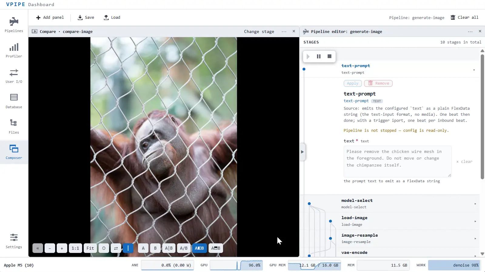

<a id="top"></a>
# VPIPE

**Real-time multimodal AI pipelines on Apple Silicon**

**VPIPE** is a small, embeddable runtime for building local AI applications
where video, audio, images, text, tensors, user input, and tool actions move
through the same inspectable pipeline. It is designed for Apple Silicon
machines and runs its on-device generative stack on a custom **metal-compute**
backend — its own Metal kernels, with no Python and no third-party tensor
runtime in the forward pass.

- Runs **MiniMax H3** FL2VA on Apple Silicon Mac — a 33B model generating
  video **and its soundtrack together**, on as little as 16 GB.
  See **[docs/MINIMAX-H3.md](docs/MINIMAX-H3.md)**

- **Built in C++** for performance and compactness

- **Full modality** support packed under **25 MB**

- Top-tier inference speed, enabling **realtime** visual question answering
  (VQA), automatic speech recognition (ASR), and language-model chat with
  text-to-speech (TTS)

- Top-tier diffusion-transformer inference speed with **weight streaming**,
  enabling image and video edits on systems with only 16 GB of memory —
  walk through a reference image edit in
  **[docs/KLEIN-KV.md](docs/KLEIN-KV.md)**

- **Local MCP** support: sandboxed file, shell, and Python tools, plus web
  fetch

- **Mobile-friendly UI** enabling remote access from a phone

- Extra acceleration from **NAX** matmul2d, convolution2d in M5 generation


[](LICENSE)


[**Overview**](#overview) · [**Requirements**](#requirements) ·
[**Build**](#build) · [**Run**](#run) · [**Examples**](EXAMPLES.md) ·
[**Tests**](#tests) · [**Structure**](#structure) ·
[**Acknowledgements**](#acknowledgements) · [**License**](#license)

---

<p align="center">
  
</p>

---

## Overview
[back to top](#top)

VPIPE has three main surfaces:

- **Pipeline core** — coroutine-based `Job` stages connected by buffered ports,
  driven by a runtime that launches and drains them concurrently. Stages are
  composed into a pipeline from a JSON spec; each stage registers under a
  type name (e.g. `rtsp-capture`, `video-to-rgb`, `yolo-detection`,
  `onvif-discovery`, `rest-client`). This layer is portable C++20.

- **On-device generative-model stack** *(Apple Silicon)* — a from-scratch
  LLM/VLM/ASR/diffusion/video inference stack running on **metal-compute**,
  with custom kernels, model loading, quantization support, weight streaming,
  and resource planning for memory-constrained Macs. It powers stages such as
  `text-chat`, `visual-qa`, `realtime-vqa`, `audio-transcribe`,
  `generate-image`, `diffusion-conditioner`, `vae-encode`, `vae-decode`, and
  `generate-video`.

- **Web UI and Composer** — a self-contained browser UI for launching,
  inspecting, profiling, and editing pipelines. The Composer can arrange
  pipeline editors, previews, image comparison views, text I/O, profiler views,
  files, logs, and stage-provided panels, then save that layout with the
  pipeline spec so a workflow can be reopened and reproduced.

Models are loaded from local directories (sharded safetensors / GGUF) and are
not bundled with the source.

> **Platform note.** The pipeline core and the non-Apple stages build on Linux
> and Intel macOS, but the generative-model stack and the CoreML/Metal stages
> require an **Apple Silicon Mac**. On arm64 macOS these features are detected
> and enabled automatically.

---

## Requirements
[back to top](#top)

- **CMake ≥ 3.25** and a **C++20** compiler (Apple Clang or a recent Clang/GCC).
- **Git** (the build pulls a few dependencies as submodules).
- **FFmpeg development headers** — `libavformat`, `libavcodec`, `libavutil`,
  `libswresample`. VPIPE compiles against the headers and `dlopen`s the
  libraries at runtime, so FFmpeg must also be installed at runtime to decode
  media.
  - macOS: `brew install ffmpeg`
  - Debian/Ubuntu: `apt install libavformat-dev libavcodec-dev libavutil-dev libswresample-dev`
- **libcurl** — used by the `rest-client` stage. Provided by the SDK on macOS;
  on Linux install e.g. `apt install libcurl4-openssl-dev`.
- **Python 3 + development headers** — only for the optional Python extension
  (built by default). Disable with `-DVPIPE_BUILD_PYTHON=OFF` if you don't need
  it.
- **Apple Silicon Mac** — for the on-device inference stack and CoreML/Metal
  stages.
- **Metal shader toolchain** *(Apple Silicon builds only; recommended, not
  required)* — by default the build compiles `.metal` kernel sources into
  embedded metallibs using `xcrun -sdk macosx metal` and
  `xcrun -sdk macosx metallib`. These compilers are part of Xcode's **Metal
  Toolchain**; the standalone *Command Line Tools* do **not** include them, even
  though the rest of the build never opens Xcode.

  **No toolchain? The build falls back automatically.** If `metal`/`metallib`
  aren't found at configure time, the build switches to **runtime-compile
  mode**: it embeds the Metal shader *source* and compiles each kernel on first
  use via the OS's built-in runtime compiler (`newLibraryWithSource:`), which
  needs no toolchain on the build **or** run machine. The Metal Toolchain is
  therefore optional; the tradeoff is a one-time per-kernel compile on first use
  instead of at build time. Force either mode with
  `-DVPIPE_METAL_RUNTIME_COMPILE=ON|OFF`.

  To get the faster build-time (AOT) path, install the toolchain. Two
  independent things can leave `metal`/`metallib` unavailable — both surface the
  same way, as `error: cannot execute tool 'metal'` or `xcrun: error: unable
  to find utility "metal"`:

  **1. The Metal Toolchain isn't installed.** On **Xcode 26 and later**
  (macOS 26) the Metal Toolchain is no longer bundled with Xcode by default —
  it's an optional component you download once. Install it from the command
  line (or via Xcode ▸ Settings ▸ Components ▸ Metal Toolchain ▸ Get):

  ```sh
  xcodebuild -downloadComponent metalToolchain     # download + install
  ```

  On air-gapped or CI machines, export once and import where needed:

  ```sh
  xcodebuild -downloadComponent metalToolchain -exportPath ~/Downloads
  xcodebuild -importComponent metalToolchain ~/Downloads/metalToolchain.dmg
  ```

  **2. `xcrun` points at the Command Line Tools, not Xcode.** If you installed
  the CLT and *then* Xcode, `xcrun` often still resolves to the standalone CLT,
  which lacks `metal`/`metallib`. Point the toolchain at Xcode:

  ```sh
  # Direct xcrun at the Xcode app (run once; needs admin)
  sudo xcode-select --switch /Applications/Xcode.app/Contents/Developer
  sudo xcodebuild -license accept    # accept the license if you haven't
  ```

  Verify the active developer dir and that both compilers resolve:

  ```sh
  xcode-select -p                 # -> /Applications/Xcode.app/Contents/Developer
  xcrun -sdk macosx -f metal      # -> a path inside Xcode.app (not /Library/Developer/CommandLineTools)
  xcrun -sdk macosx -f metallib   # -> likewise
  xcrun -sdk macosx metal --version
  ```

  To switch back to the Command Line Tools later:
  `sudo xcode-select --switch /Library/Developer/CommandLineTools`.

---

## Build
[back to top](#top)

**1. Fetch dependencies.** LMDB and pugixml are always required; nanobind is
needed for the Python bindings, and metal-cpp for the Apple Silicon features:

```sh
git submodule update --init extern/lmdb extern/pugixml extern/nanobind extern/metal-cpp
```

**2. Configure** (out-of-source build directory):

```sh
cmake -S . -B build
```

This defaults to an optimized **Release** build, so the binaries you get are
performant out of the box. Override the build type explicitly if you want a
debug build:

```sh
cmake -S . -B build -DCMAKE_BUILD_TYPE=Debug
```

**3. Build:**

```sh
cmake --build build -j
```

`cmake --build` is generator-agnostic; use it rather than calling `make`
directly so the build works regardless of which generator CMake selected.

Useful options (pass at configure time with `-D`):

| Option | Default | Effect |
| --- | --- | --- |
| `VPIPE_BUILD_PYTHON` | `ON` | Build the `vpipe` Python extension (needs Python dev headers). |
| `VPIPE_BUILD_APPLE_SILICON` | auto (on for arm64 macOS) | Build the CoreML/metal-compute wrappers and the inference stages. |
| `CMAKE_BUILD_TYPE` | `Release` (when unset) | Set `Debug` for an unoptimized debug build. |

**Install** (optional):

```sh
cmake --install build --prefix /path/to/install
```

---

## Run
[back to top](#top)

### Web UI

`vpipe-web-ui` serves a browser-based Pipeline Manager bound to one VPIPE
session. The web assets are embedded in the binary, so no extra files are
needed:

```sh
./build/apps/web-ui/vpipe-web-ui                    # listens on the LAN address, port 9876
./build/apps/web-ui/vpipe-web-ui --bind 127.0.0.1   # this machine only
```

Then open the printed URL (e.g. `http://localhost:9876`). By default it binds
to the machine's LAN address so other devices can connect; remote connections
must supply the 8-character access key printed at startup, while localhost
connects without one. Options: `--bind ADDR`, `--port N` (`0` = any free port),
`--config CFG` (inline JSON, a file path, or empty for defaults), `--help`.

#### Connecting a phone (`--show-qr`)

The UI has a phone layout, and typing an 8-character key into a phone is
exactly the friction that stops anyone using it. `--show-qr` prints a QR code
to the console next to the usual startup lines:

```sh
./build/apps/web-ui/vpipe-web-ui --show-qr
```

Point a phone camera at it and the UI opens **already authenticated** — no key
to read off the screen and retype. The phone layout is selected automatically
from the device; `?ui=desktop` (or the drawer's *Desktop layout*) overrides it,
and `?ui=phone` is how that layout is developed on a desktop.

How it works, and what it costs:

- **Two different secrets.** The 8-character access key is short because a
  human retypes it. The QR link carries its own, longer secret (14 characters
  of an uppercase alphanumeric alphabet, ~70 bits), because nothing has to read
  it — it only has to be unguessable.
- **One scan, then the key is gone.** `GET /<link-secret>` redirects to
  `/?key=<access key>`; the page adopts the key into `sessionStorage` and
  immediately strips it from the URL, so it never lands in the address bar,
  the history, or a bookmark. The key is tab-scoped and disappears when the
  tab closes.
- **The link is never printed.** Only the symbol is rendered — writing the URL
  beside it would put the secret into the scrollback, a screen share, or a
  terminal log, which is what the QR code exists to avoid. It is a secret in a
  URL: treat it as **only as private as the console displaying it**, and
  restart the server to invalidate it.
- **Both secrets are per-run**, generated at startup, and neither is written to
  disk.

Requests from other computers carry the key as an `X-Auth-Key` header (or a
`?key=` parameter where the browser cannot set headers, such as a WebSocket
handshake or an `` source). Only `/api/*` is gated, and only for
non-loopback peers — static assets stay open so a remote browser can load the
page in order to ask for the key in the first place.

> **Note.** Add `--tls` if you want the low-latency Preview view on a phone or
> any other LAN client: the browser's WebCodecs API is secure-context only, so
> it needs HTTPS off localhost. The certificate is self-signed and cached under
> `~/.vpipe/webui-tls`, so expect a one-time browser warning — and a QR scan
> lands on that warning rather than the UI until it is accepted.

New here? **[EXAMPLES.md](EXAMPLES.md)** walks through fetching a model and
building text-chat and speech-transcription pipelines in the web UI.
For text-to-video-and-audio, **[docs/MINIMAX-H3.md](docs/MINIMAX-H3.md)**
covers preparing MiniMax H3 and running it, with both pipelines to download.

### CLI

`vpipe` launches pipelines straight from the terminal — a thin command-line
front end over the same session and stages the web UI drives. It dynamically
links `libvpipe`.

```sh
# A full pipeline from a saved spec file, or from inline JSON:
./build/apps/vpipe/vpipe --launch my-pipeline.vpipeline
./build/apps/vpipe/vpipe --launch '{"id":"tick","stages":[{"id":"c","type":"chrono","config":{"count":5}}]}'

# A single stage wrapped in a one-shot pipeline (handy for utility stages):
./build/apps/vpipe/vpipe --launch-stage onvif-discovery
./build/apps/vpipe/vpipe --launch-stage model-fetch \
  --stage-cfg model_path=mlx-community/Qwen3.5-4B-MLX-4bit
```

`--stage-cfg` overrides stage config: `key=value` after `--launch-stage`, or
`stage-id::key=value` to target a stage inside a `--launch` spec. Repeat
`--launch` / `--launch-stage` to run several pipelines **concurrently**;
`Ctrl-C` stops them cleanly. `vpipe --help` lists every option, and
**[EXAMPLES.md](EXAMPLES.md)** shows fetching a model from the terminal.

### Python

The extension lands in `build/python/`. Importing the package creates a default
session:

```sh
PYTHONPATH=build/python python3 -c "import vpipe; print(vpipe.vpipe_version())"
```

Startup configuration is resolved from `VPIPE_CONFIG` / `VPIPE_CONFIG_FILE`, an
`./init.vpipe` file, or built-in defaults. Call `vpipe.create_session(config=...)`
to make your own session.

### Log reader

`vpipe-db-log-reader` dumps (or prunes) records from a VPIPE LMDB log database:

```sh
./build/apps/db-log-reader/vpipe-db-log-reader <db-path> [--from TS] [--to TS]
```

---

## Tests
[back to top](#top)

The build produces a unit-test executable:

```sh
./build/vpipe_test                        # run everything
./build/vpipe_test --list_tests
./build/vpipe_test --filter '<pattern>'   # supports * and ? wildcards
./build/vpipe_test --color off            # for captured/non-interactive output
```

Some tests exercise real models and are gated on environment variables that
point at local model directories; when a variable is unset, the corresponding
test skips.

---

## Structure
[back to top](#top)

| Path | Contents |
| --- | --- |
| `pipeline/`, `common/`, `interfaces/`, `include/` | Pipeline core: jobs, ports, runtime, session, shared services. |
| `stages/` | Pipeline stages (capture, decode, detection, REST, the LLM/VLM stages, …). |
| `generative-models/` | On-device LLM/VLM/ASR stack (model families, tokenizers, encoders). |
| `apple-silicon/` | metal-compute backend and CoreML C++ wrappers. |
| `gpu-kernels/metal/` | Metal compute kernels (attention, GEMM, quant, …). |
| `apps/` | Executables: `vpipe` (CLI), `web-ui`, `db-log-reader`. |
| `python/` | Python bindings (nanobind). |
| `tests/` | Unit tests. |
| `extern/`, `3rd-party/` | Vendored dependencies. |

---

## Acknowledgements
[back to top](#top)

VPIPE builds on these projects:

- **[FFmpeg](https://ffmpeg.org)** — the multimedia framework vpipe decodes
  and encodes audio and video with; compiled against its headers and
  `dlopen`ed at runtime. *LGPL-2.1-or-later (some optional components are
  GPL).*
- **[LMDB](https://github.com/LMDB/lmdb)** — the memory-mapped key-value
  store behind vpipe's databases: logs, the model registry, camera records.
  *OpenLDAP Public License 2.8.*
- **[pugixml](https://github.com/zeux/pugixml)** — a light XML parser, used
  for the SOAP and WS-Discovery exchanges that find ONVIF cameras. *MIT.*
- **[nanobind](https://github.com/wjakob/nanobind)** — the C++/Python
  binding layer the `vpipe` Python extension is built with. *BSD 3-Clause.*
- **[metal-cpp](https://github.com/bkaradzic/metal-cpp)** — header-only C++
  bindings for Apple's Objective-C runtime; vpipe uses its `Foundation`
  headers under the CoreML and metal-compute wrappers. *Apache-2.0.*
- **[pocketfft](https://gitlab.mpcdf.mpg.de/mtr/pocketfft)** — a header-only
  FFT, used by the audio feature extractors to build mel spectrograms.
  *BSD 3-Clause.*

**[MLX](https://github.com/ml-explore/mlx)** *(MIT)* is Apple's array
framework for machine learning on Apple Silicon. VPIPE does not link MLX and
does not use it in the forward pass, but it does vendor a small set of MLX's
Metal kernel headers — the "steel" GEMM and attention templates and their
supporting helpers — under
`gpu-kernels/metal/vendored/mlx/backend/metal/kernels/steel`. Those headers
are `#include`d by vpipe's own `.metal` sources and compiled into the
embedded metallibs.

Full copyright and license texts for everything bundled or vendored are in
[`THIRD_PARTY_LICENSES.md`](THIRD_PARTY_LICENSES.md).

---

## License
[back to top](#top)

VPIPE is licensed under the **Apache License, Version 2.0** — see
[`LICENSE`](LICENSE). Bundled and vendored third-party components and their
licenses are documented in
[`THIRD_PARTY_LICENSES.md`](THIRD_PARTY_LICENSES.md).

Brought to you by T-Go LLC.
